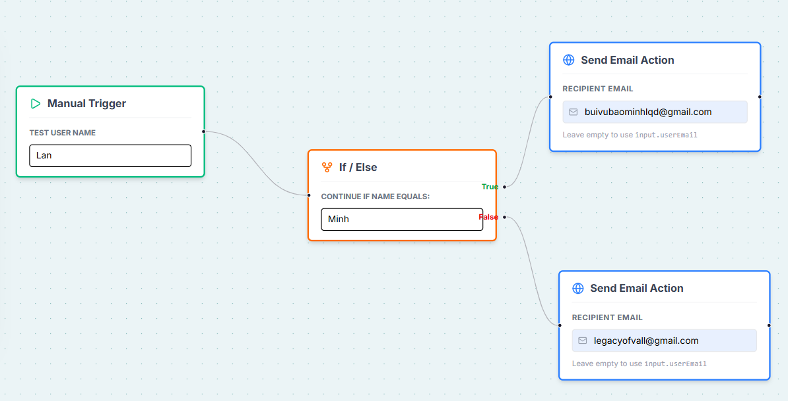

# n8nMVP

# n8n-MVP: Low-Code Workflow Automation Platform

Hello, this is my attempt in building the very very MVP version of *n8n*.

 

## 🚀 Minimal Features (I guess)

* **Visual Workflow Editor:** Drag-and-drop interface powered by **React Flow** to connect nodes.
* **Asynchronous Execution:** Heavy workflows are offloaded to **Redis** and processed by a dedicated **BullMQ Worker**, ensuring the UI never freezes.
* **Dynamic Logic:** Nodes are configuration-driven. Supports conditional logic (`If/Else`), user inputs, and variable passing between nodes.
* **Node Types:**
    * **Manual Trigger:** Starts the flow with custom user data.
    * **If / Else (Condition):** Routes execution logic based on data comparison.
    * **HTTP / Email Request:** Sends real emails via Nodemailer (Gmail integration).
    * **AI Agent:** (Mocked) Placeholder for LLM processing.
    * **Custom Code:** (Mocked) Placeholder for a custom code processor.

## 🛠 Tech Stack

* **Frontend:** Next.js 14 (App Router), Tailwind CSS, React Flow, Lucide React.
* **Backend:** Next.js API Routes (Serverless functions).
* **Database:** MongoDB (Mongoose) - Stores workflow structures and execution logs.
* **Queue System:** Redis + BullMQ - Manages job distribution.
* **Worker:** TypeScript/Node.js - A standalone process that executes the graph logic (`ExecutionEngine`).

## 📦 Prerequisites

Before running the project, ensure you have the following installed:

* **Node.js** (v18 or higher)
* **MongoDB** (Running locally or via Atlas)
* **Redis** (Running locally on port `6379`)

## ⚡ Installation & Setup

1.  **Clone the repository:**
    ```bash
    git clone https://github.com/BuiVuBaoMinh/n8nMVP.git
    cd n8n-mvp/n8n-mvp-app
    ```

2.  **Install dependencies:**
    ```bash
    npm install
    ```

3.  **Configure Environment Variables:**
    Create a `.env` file in the root directory and add the following keys.
    *(Note: You need an App Password for Gmail if using 2FA).*

    ```env
    # Database
    MONGODB_URI=mongodb://localhost:27017/n8n-remake

    # Redis (Optional if using defaults)
    REDIS_HOST=localhost
    REDIS_PORT=6379

    # Email Service (for HttpRequest Node)
    GMAIL_USER=your-email@gmail.com
    GMAIL_PASS=your-gmail-app-password
    ```

4. **Configure Docker:**
    Run this once in your first launch

    ```bash
    docker run -d -p 6379:6379 --name n8n-redis redis:alpine
    docker run -d -p 27017:27017 --name n8n-mongo mongo:latest
    ```
    Then run this in next launches:
    ```bash
    docker-compose up
    ```

## 🏃‍♂️ How to Run

This architecture requires **two** separate processes running simultaneously: the web server and the background worker.

### Terminal 1: Start the Web App
This runs the Next.js frontend and API.
```bash
npm run dev
```

### Terminal 2: Start the Execution Worker
This runs the background process that listens to Redis and executes workflows.
```bash
npx tsx executionWorker.ts
```
> You should see: ```Worker is running and listening for jobs...```

## 🎮 Usage Guide
### 1. Create a Workflow:

* Open http://localhost:3000.

* Drag nodes (e.g., Trigger, Condition, Email) from the sidebar onto the canvas.

* Connect the handles (Trigger Source → Condition Target). Target souces (inputs) are on the left side of a node (rectangular shaped). The outputs of a Node extend on the right.

### 2. Configure Nodes:

* Click the Manual Trigger node and enter a test name (e.g., "Minh").

* Click the If/Else node and set the expected value to "Minh".

* Click the Email Action node (currently, I use the HttpRequestNode for this purpose) and enter your recipient email address.

### 3. Save & Run:

* Click the Save Workflow button (Workflow ID will alert).

* Click Run Workflow.

### 4. Verify Execution:

* Check Terminal 2 (Worker). You will see logs like:
```bash
[Worker] Processing Job 51
[Engine] Starting workflow 69862204fd882b4da2f485ab
[Engine] Node trigger finished.
   [Logic] Checking: Is 'Lan' === 'Minh'?
[Engine] Node condition finished.
   [Action] Sending email to: legacyofvall@gmail.com
   [Action] Email Sent: 250 2.0.0 OK  1770399317 98e67ed59e1d1-354b2ebecd6sm1229729a91.0 - gsmtp
[Engine] Node httpRequest finished.
[Worker] Workflow 69862204fd882b4da2f485ab Completed! {
  status: 'completed',
  context: {
    '1': {
      triggeredAt: '2026-02-06T17:35:07.350Z',
      userName: 'Lan',
      userEmail: 'legacyofvall@gmail.com'
    },
    'condition-1770398185419': {
      triggeredAt: '2026-02-06T17:35:07.350Z',
      userName: 'Lan',
      userEmail: 'legacyofvall@gmail.com',
      result: false
    },
    'httpRequest-1770398194659': {
      sent: true,
      messageId: '<3a9c2859-a20e-8e7b-9406-d4692d4ea74b@gmail.com>'
    }
  }
}
```
* The above log is from this example workflow:


## 📂 Project Structure
```bash
.
├── n8n-mvp-app/
│   ├── api/              # API Routes (POST /execution, POST /workflows)
│   ├── types/workflow.ts 
│   └── page.tsx          # Main Entry
├── components/
│   ├── canvas/           # React Flow components (FlowCanvas, Nodes)
│   └── layout/           # Sidebar, Navbar
├── lib/
│   ├── db.ts             # MongoDB Connection
│   ├── queue.ts          # BullMQ Queue Setup
│   └── executeEngine.ts  # Core executor: Graph Traversal Logic
├── models/               # Mongoose Schemas (Workflow.ts)
├── workers/executionWorker.ts    # Background Worker Entry Point
└── public/
```